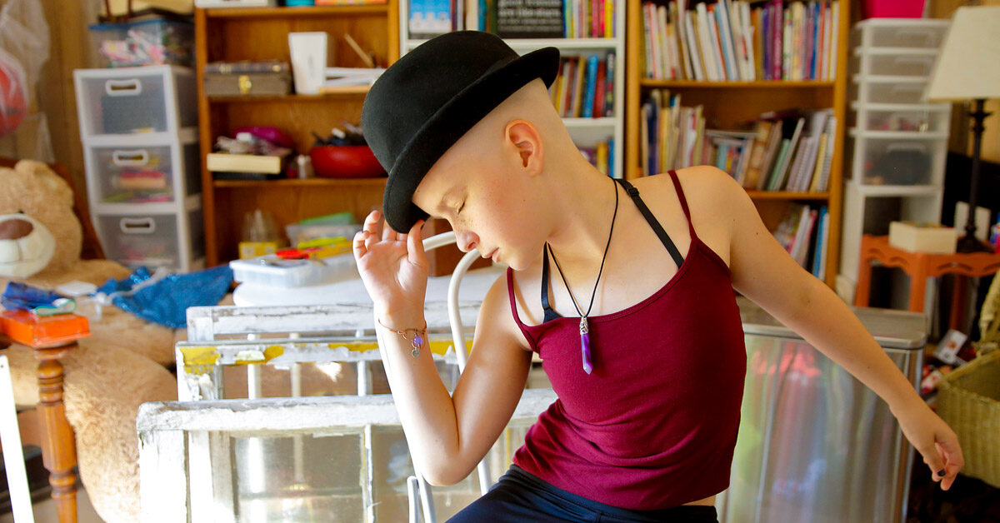
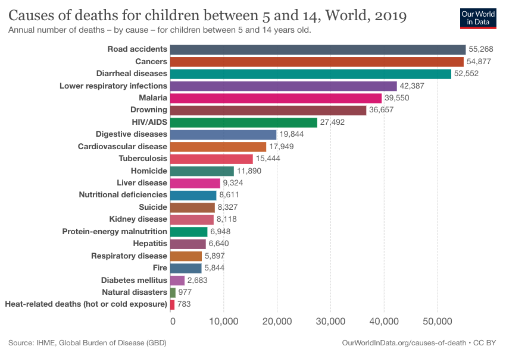
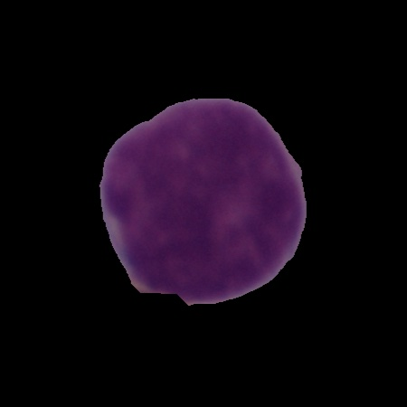
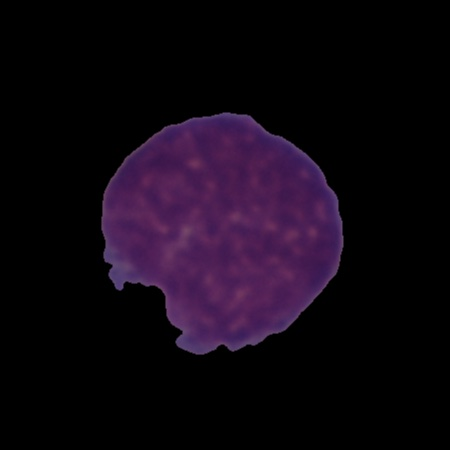
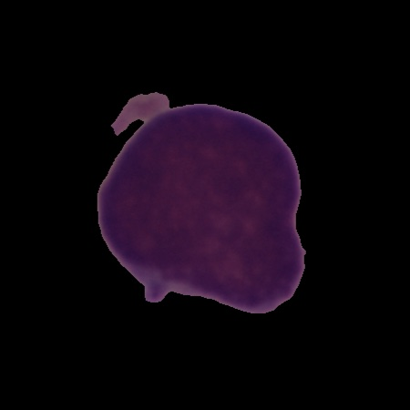
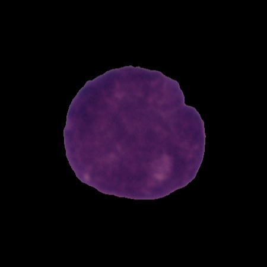
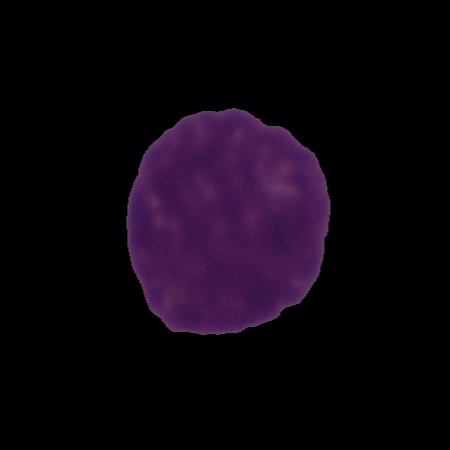

# Acute Lymphoblastic Leukemia (ALL) Diagnosis Using Neural Networks

[A Guide to Leukemia](https://www.healthline.com/health/leukemia)

[Chilhood Cancer Statistics](https://www.acco.org/childhood-cancer-statistics/)

[Childhood Leukemia Statistics](https://www.acco.org/childhood-leukemias/)

[Survival Rates and Outlook for Acute Lymphocytic Leukemia (ALL)](https://www.healthline.com/health/acute-lymphocytic-leukemia-survival-rate-outlook)

>### *Dance like no one is watching*     
>### *Live like you are dying*           
>### *Regret the things you've done, not what you didn't do*

 

## Business Understanding:

>### Cancer is the leading disease-related cause of death in children aged 5 to 14, and leukemia is the most prevalent form of cancer in children. 75% will be diagnosed with Acute Lymphoblastic Leukemia (ALL). [Childhood Leukemia Statistics](https://www.acco.org/childhood-leukemias/)

>### Survival rate is directly correlated with how early it is caught. If we can catch the leukemia early enough, we can save many more lives. 

>### I seek to create a method to accurately diagnose leukemia by taking pictures of white blood cells and predicting if they are normal or cancerous. A Machine Learning model that can accurately identify leukemia cells will enhance the medical profession’s ability to diagnosis at an early stage. Humans are prone to error so a model that can accurately predict will help with that human error.



## Data Understanding

> ### Leukemia manifests itself in immature white blood cells called blasts. The data for this project consists of images of white blood cells that have been analyzed under a microscope and labeled as normal or cancerous.
>### The dataset comes from the [Cancer Imaging Archive](https://wiki.cancerimagingarchive.net/pages/viewpage.action?pageId=52758223)    
>>#### To download this, you will need to use the data sharing browser extension [IBM Aspera Connect](https://www.ibm.com/aspera/connect/). 
>>>When you download the data it will automatically walk you through the process, it is simple and painless.

## Image Samples







### The data for this project was acquired in three parts:

> #### 1) A training set separated into 3 directories, each with separate class labeled directories
> #### 2) A validation set with all images in the same directory and a CSV file with filenames and class labels
> #### 3) A test set with no class labels

- #### We will combine all the data of the training and validation sets into labeled directories and split the whole into training, validation, and test sets for use in this project.
> The code steps that follow below will set this up, creating all necessary directories from the downloaded file . Just create a fodrop the downloaded file into a 

- #### We will re-name the provided test set to "unlabeled_images" and reserve it for demonstration purposes, as there is no way of knowing if the predicitions are correct and how a particular model is performing with it.

```
Our Class indeces will be:
{'Normal': 0, 'ALL': 1}
```

## The Method

###  First we must pre-process the images as mentioned above, and geneerate the data for use in our modeling

###  When our data is ready for modeling, we will then use various methods to build robust neural networks to predict whether a cell is normal or cancerous. 
>#### The dataset is imbalanced , so we will set the class weight to 'balanced' in our models.
>#### We will build a baseline model using basic dense layers
>#### Then we will iterate through several convolutional neural network models using various tuning techniques
>>#### Augmentation: (Rotation, Vertical and Horizontal Flipping, and Brightnes adjustments)
>>#### Dropout Layers
>>#### Regularization

## Model Scoring

> #### False Negative:
>> Labeling a cancerous cell as normal
> #### False Positve:
>> Labeling a normal cell as cancerous

### Being that this is a cancer diagnosis, we need to minimize false negatives. Missing a cancer diagnosis is the worst case scenario. Therefore we will need to maximize the RECALL score and correctly predict as many true popsitives as possible. We will shoot for a RECALL of over 90% for this projects purposes.


# Results

## Our top performing model was a basic convolutional model using data augmentation:
- > ### We used three convolutional layers with 32, 64, and 64 nodes each respectively, with the 'relu' activation function
- > ### We used a flttening layer and two dense layers of 32 and 64 nodes each respectively

> ## RECALL - 91.14 %
> ## ACCURACY - 82.4 %

```
cnn_aug = models.Sequential()

cnn_aug.add(layers.Conv2D(32,(3,3), activation='relu', padding='same', input_shape=(256,256,3)))
cnn_aug.add(layers.MaxPool2D(2,2))

cnn_aug.add(layers.Conv2D(64,(3,3), activation='relu', padding='same'))
cnn_aug.add(layers.MaxPool2D(2,2))

cnn_aug.add(layers.Conv2D(64,(3,3), activation='relu', padding='same'))
cnn_aug.add(layers.MaxPool2D(2,2))

cnn_aug.add(layers.Flatten())
cnn_aug.add(layers.Dense(64, activation='relu'))
cnn_aug.add(layers.Dense(1, activation='sigmoid'))
```
[result_1](data/Result_1.png)[result_2](data/Result_2.png)

## Interpretation
- >### The use of dropout layers and regularization resulted in poorer performing models. 
- >### Also, the use of more deep layering resulted in poorer scoring models.
>> ### The images were of tiny cells with out many deep features, much of what makes a cell is in its chemical and genetic makeup, so perhaps we were able to extract as much information as possible out of our images with the most basic convolutional model and adding deeper layers was just creating noise.

# Reccomendations
- > ### A concerted effort within the healthcare industry must be made to implement a preventative care process for analyzing the white blood cells in children for early detection of leukemia.
- >### Image classification can cut down on human error and aid healthcare professionals in recognizing & diagnosing leukemia in a preventative, early detection setting.

## Further Steps
- > ### Further tune the model's convolutional layers to improve recall and accuracy.... 
>> ### (i.e. activation functions, # of nodes)
- > ### Apply image filters such as the Laplacian Operator for deeper feature recognition
- > ### Explore different pooling, normalization and Regularization, as well as tuning pre-trained models

# For more information and for my code please see the .ipynb notebook [HERE](https://github.com/patrick-anastasio/Neural-Network-Image-Classification/blob/main/Image_Classification_Notebook.ipynb)


### Thank You

Patrick Anastasio
>sudomakecoffee1@gmail.com       
>LinkedIn : @patrickanastasio      
>Github : patrick-anastasio

```
├── Web_App                                    # folder conatining files for the web app
    ├── app.py                                 # python script to run web app (front-end)
    ├── my_model.hdf5                          # model data for running the web app (back-end)
├── Data                                       # images used in project, sample data for running web app
├── Image_Classification_Notebook.ipynb        # code/project notebook
├── Presentation.pdf                           # non-technical stakeholder presentation slides
└── README.md                                  # the top-level README for reviewers of this project
```
